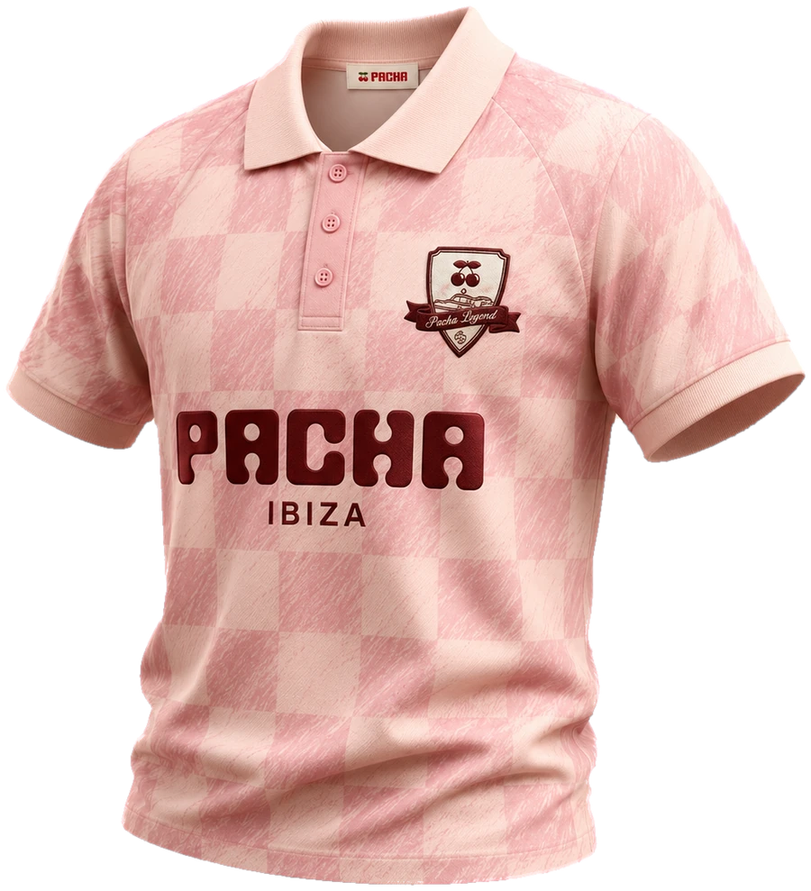

# PACHA IBIZA — hero section

A warm, editorial hero built around a single product shot: cream stage, giant
background wordmark, the checkerboard polo floating as the protagonist, a
small editorial kicker, and copy in the corners.

> Concept / art-direction exercise. Unofficial — not affiliated with Pacha.

```
hero-pacha-ibiza/
├── index.html              # the hero (self-contained: CSS + ~40 lines of JS)
└── assets/polo-pacha.webp  # the product, cut out of its studio background
```

Open `index.html` directly in a browser — there is no build step.

## The product asset

`assets/polo-pacha.webp` is the supplied product photograph with its beige
studio background and drop shadow removed (900×989, transparent, 146 KB).

The cutout was done programmatically rather than by hand, because the polo's
lightest cream squares sit within ~15 RGB of the studio beige. A plain
flood-fill at a tolerance loose enough to catch the background also leaked
through the shadow under the left collar wing and ate part of the garment.
What the final matte does instead:

1. **Flood-fill at tolerance 14, not 22** — measured as the ceiling before the
   fill escapes into the collar (82 lost px at 14, 3 525 at 16).
2. **Shadow removed chromatically** — the drop shadow is beige scaled down, so
   it is caught by `|rgb − k·bg| < 12` with `k` between 0.22 and 1.04, rather
   than by brightness.
3. **Alpha demands two things at once** — geometric interiority *and* a real
   colour difference from beige. Either alone leaves a halo or punches holes in
   the cream squares.
4. **Colour decontamination** on the semi-transparent rim, un-mixing the beige
   back out so the edge does not glow on a different background.

### Swapping it

Drop your file into `assets/` and change one `src`:

```html

```

Portrait, transparent background, roughly **0.85–1.0 aspect**. Sizing, the
float, the parallax and the shadow all key off `.product__img` (marked
`SWAP POINT` in the stylesheet). Keep `alt=""` — the garment is decorative and
the accessible name lives in the visually hidden `<h1>`. Update the `width` and
`height` attributes to the new file's real pixel size.

**If the garment carries its own chest print**, check where the kicker lands.
This polo does, so the kicker sits at 67% — down on the plain lower body — and
not over the chest, where it would collide with the printed lockup.

## Editing the copy

Every text block is plain HTML marked with an `EDIT:` comment — brand, nav
links, CTA, background wordmark, kicker, editorial copy, info card.
The visually hidden `<h1>` carries the message for screen readers; update it
alongside the visible art so the two stay in sync.

## Design notes

- **Palette sampled from the photograph** so the garment sits in light that
  matches the shot it was cut from: studio beige `#e6d6c6` became the page
  ground, the logo oxblood `#6f2b24` is the single accent, and the polo's pink
  drives the hairlines.
- **Type** — Baloo 2 800 for the wordmark and brand, chosen because its rounded
  bowls echo the polo's own logotype; Inter for UI and the editorial micro-type.
- **Lighting** — the stage is lit like a warm studio rather than a dark set:
  key pool behind the garment, wash from the top-left, an oxblood whisper at the
  centre, a warm burn at the edges, and 5.5% grain on `multiply` so the texture
  reads as paper rather than milk.
- **Motion** — staggered fade + translate on load, an 11s float, pointer
  parallax (wordmark drifts with the cursor, garment against it) and scroll
  parallax on the wordmark. All disabled under `prefers-reduced-motion`.
- **Accessibility** — every text token clears 4.5:1 against the stage; the
  low-contrast wordmark and the kicker are `aria-hidden` decoration; all seven
  interactive elements take a 2px oxblood focus ring.
- **Responsive** — verified in Chromium at 16 widths from 320px to 1600px: no
  horizontal overflow, and no collisions between the garment, the copy and the
  info card at any of them.
