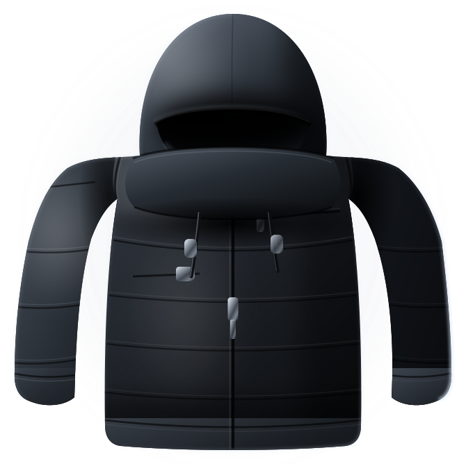

# SYNTH ERA — hero section

A premium fashion-campaign hero: near-black stage, giant background wordmark,
a floating technical jacket as the protagonist, a hand-scrawled violet overlay,
and editorial copy in the corners.

```
hero-synth-era/
├── index.html                  # the hero (self-contained: CSS + ~40 lines of JS)
└── assets/product-jacket.svg   # the product render (placeholder)
```

Open `index.html` directly in a browser — there is no build step.

## Swapping the product

The garment is a hand-built SVG placeholder standing in for a real 3D render.
To replace it, drop your file into `assets/` and change one `src`:

```html

```

The render should be **portrait, roughly 0.95–1.05 aspect, on a transparent
background** (PNG or WEBP). Sizing, the floating animation, the parallax and the
drop shadow all key off `.product__img`, so nothing else needs to change. Keep
`alt=""` — the garment is decorative, and the accessible name lives in the
visually hidden `<h1>`.

If your render has a different aspect ratio, adjust `max-width` on
`.product__img` (marked `SWAP POINT` in the stylesheet) and the `top` / `bottom`
percentages on `.product` per breakpoint.

## Editing the copy

Every text block is plain HTML marked with an `EDIT:` comment — brand, nav
links, CTA, background wordmark, scrawl, kicker, editorial copy, info card.
The visually hidden `<h1>` carries the message for screen readers; update it
alongside the visible art so the two stay in sync.

## Design notes

- **Type** — Archivo 900 for the wordmark (`clamp(3.1rem, 14.6vw, 13.5rem)`,
  `-0.045em` tracking), Inter for UI, Caveat 700 for the scrawl.
- **Colour** — charcoal `#0d0e10` with exactly one accent, `--violet: #9b5cff`,
  used only on the scrawl, the pre-order dot and focus rings.
- **Lighting** — the stage layers a key pool behind the garment, a cool wash
  from the top-left, a violet whisper under the scrawl, a crushing vignette,
  and 5% film grain. The SVG is lit to match: key from upper-left, cool rim
  along the right contour.
- **Motion** — staggered fade + translate on load, an 11s float on the garment,
  pointer parallax (wordmark drifts with the cursor, garment against it) and
  scroll parallax on the wordmark. All of it is disabled under
  `prefers-reduced-motion: reduce`.
- **Accessibility** — every text token clears 4.5:1 against the stage; the
  low-contrast wordmark and the scrawl are `aria-hidden` decoration; all seven
  interactive elements take a 2px violet focus ring.
- **Responsive** — verified with no horizontal overflow and no element
  collisions from 320px to 1600px.
